# Kịch bản thuyết trình: Dân tộc trong thời kỳ quá độ lên chủ nghĩa xã hội

Lời nói của cả nhóm, chia theo người và theo đúng 27 màn hình của bài trình chiếu. Số màn hình trùng với bộ đếm ở góc dưới bên phải slide (ví dụ 10 / 27). Mỗi màn có ảnh chụp slide, một dòng tóm tắt chữ và ảnh đang chiếu, rồi lời nói đầy đủ.

## Phân công

Bấm vào tên thành viên để mở file riêng của người đó.

| Người nói | Màn hình | Nội dung | Thời lượng nói |
| --- | --- | --- | --- |
| [Thành viên 1](kich-ban/thanh-vien-1.md) | 1 đến 6 | Mở đầu, sự hình thành dân tộc và hai nghĩa của dân tộc | khoảng 5,5 phút |
| [Thành viên 2](kich-ban/thanh-vien-2.md) | 7 đến 11 | Hai xu hướng khách quan và Cương lĩnh dân tộc | khoảng 6 phút |
| [Thành viên 3](kich-ban/thanh-vien-3.md) | 12 đến 17 | Sáu đặc điểm dân tộc Việt Nam | khoảng 5 phút |
| [Thành viên 4](kich-ban/thanh-vien-4.md) | 18 đến 20 | Quan điểm của Đảng và Nhà nước về vấn đề dân tộc | khoảng 3,5 phút |
| [Thành viên 5](kich-ban/thanh-vien-5.md) | 21 đến 27 | Chính sách dân tộc, tổng kết, trò chơi và lời cảm ơn | khoảng 4,5 phút |

Tổng thời gian nói khoảng 24 phút (tốc độ vừa phải, khoảng 170 tiếng mỗi phút), chưa tính thời gian chơi trò chơi.

## Thành viên 1 (màn 1 đến 6): Mở đầu, sự hình thành dân tộc và hai nghĩa của dân tộc

### Màn 1. Bìa

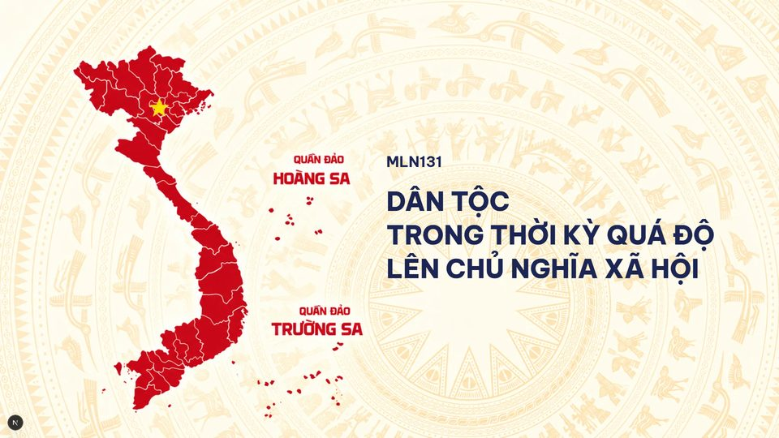

> **Trên slide:** MLN131. Dân tộc trong thời kỳ quá độ lên chủ nghĩa xã hội.
>
> **Ảnh:** Nền slide: bản đồ Việt Nam trên nền trống đồng, có quần đảo Hoàng Sa và quần đảo Trường Sa.

Em xin chào thầy cô và các bạn. Hôm nay nhóm em xin trình bày chủ đề: dân tộc trong thời kỳ quá độ lên chủ nghĩa xã hội. Đây là vấn đề vừa có ý nghĩa lý luận, vừa rất gần với thực tiễn nước ta, một quốc gia có 54 dân tộc cùng chung sống.

### Màn 2. Nội dung

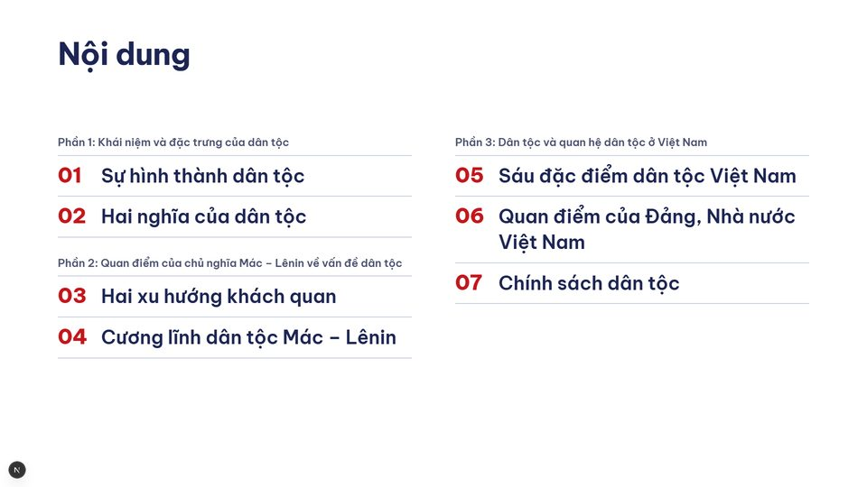

> **Trên slide:** Phần 1: Khái niệm và đặc trưng của dân tộc. 01 Sự hình thành dân tộc. 02 Hai nghĩa của dân tộc. Phần 2: Quan điểm của chủ nghĩa Mác – Lênin về vấn đề dân tộc. 03 Hai xu hướng khách quan. 04 Cương lĩnh dân tộc Mác – Lênin. Phần 3: Dân tộc và quan hệ dân tộc ở Việt Nam. 05 Sáu đặc điểm dân tộc Việt Nam. 06 Quan điểm của Đảng, Nhà nước Việt Nam. 07 Chính sách dân tộc.
>
> **Ảnh:** không có ảnh.

Bài trình bày gồm ba phần. Phần một là khái niệm và đặc trưng của dân tộc, gồm sự hình thành dân tộc và hai nghĩa của dân tộc. Phần hai là quan điểm của chủ nghĩa Mác – Lênin về vấn đề dân tộc, gồm hai xu hướng khách quan và Cương lĩnh dân tộc. Phần ba là dân tộc và quan hệ dân tộc ở Việt Nam, gồm sáu đặc điểm dân tộc Việt Nam, quan điểm của Đảng và Nhà nước, và chính sách dân tộc.

### Màn 3. Mở đầu phần 1

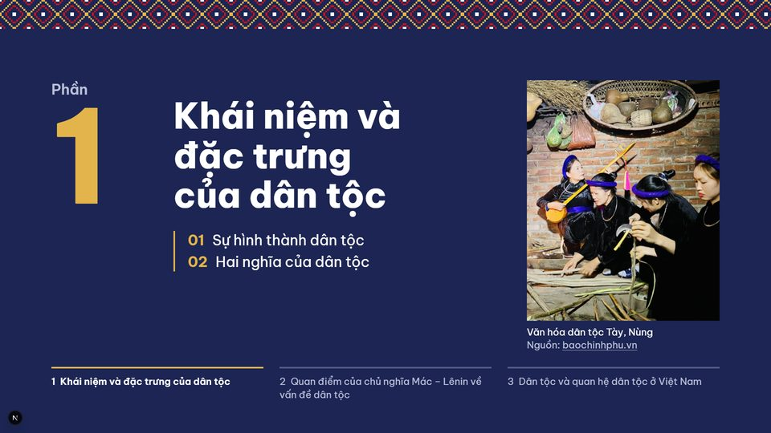

> **Trên slide:** Phần 1. Khái niệm và đặc trưng của dân tộc. 01 Sự hình thành dân tộc. 02 Hai nghĩa của dân tộc.
>
> **Ảnh:** Bên phải: Văn hóa dân tộc Tày, Nùng.

Em xin bắt đầu với phần một: khái niệm và đặc trưng của dân tộc. Ảnh bên phải là một nét văn hóa của dân tộc Tày, Nùng. Trước khi trả lời dân tộc là gì, chúng ta cùng xem dân tộc đã hình thành như thế nào.

### Màn 4. Sự hình thành dân tộc

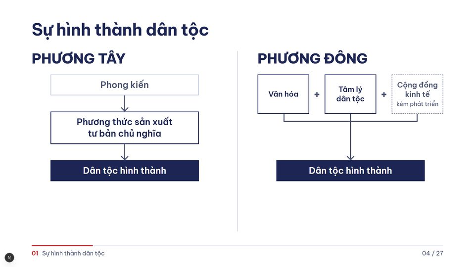

> **Trên slide:** Cột trái, Phương Tây: Phong kiến, rồi Phương thức sản xuất tư bản chủ nghĩa, rồi Dân tộc hình thành. Cột phải, Phương Đông: Văn hóa, Tâm lý dân tộc, Cộng đồng kinh tế (kém phát triển, ô viền đứt) cùng dẫn tới Dân tộc hình thành.
>
> **Ảnh:** không có ảnh.

Dân tộc là kết quả của một quá trình phát triển lâu dài của xã hội loài người, đi qua các hình thức cộng đồng từ thấp đến cao: thị tộc, bộ lạc, bộ tộc rồi mới đến dân tộc. Nguyên nhân quyết định sự thay đổi đó là sự biến đổi của phương thức sản xuất. Tuy vậy, dân tộc ở phương Tây và ở phương Đông hình thành theo hai con đường khác nhau.

Ở phương Tây, dân tộc xuất hiện khi phương thức sản xuất tư bản chủ nghĩa được xác lập, thay thế phương thức sản xuất phong kiến. Như sơ đồ bên trái: khi chuyển từ phong kiến sang phương thức sản xuất tư bản chủ nghĩa, kinh tế hàng hóa phát triển, thị trường thống nhất ra đời, gắn các vùng lại với nhau, và dân tộc hình thành.

Ở phương Đông, con đường lại khác. Dân tộc hình thành trên nền tảng một nền văn hóa và một tâm lý dân tộc đã phát triển tương đối chín muồi, trong khi cộng đồng kinh tế tuy đã đạt một mức độ nhất định nhưng nhìn chung còn kém phát triển và phân tán. Vì vậy trên sơ đồ, ô cộng đồng kinh tế có viền đứt. Việt Nam là một ví dụ: nhu cầu cùng nhau trị thủy và chống giặc ngoại xâm đã gắn kết cộng đồng từ rất sớm, nên dân tộc Việt Nam hình thành từ rất sớm, trước khi có chủ nghĩa tư bản.

### Màn 5. Hai nghĩa của dân tộc, bước 1

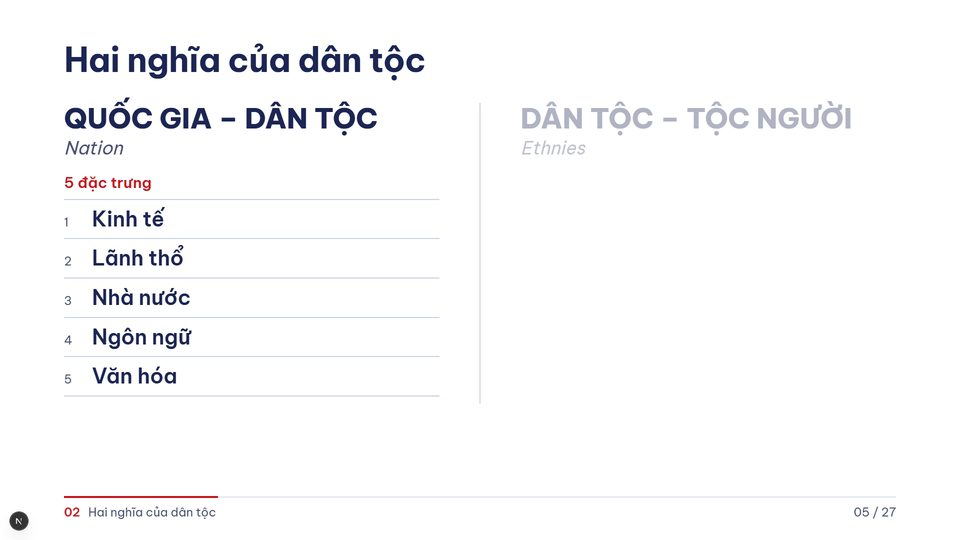

> **Trên slide:** Cột trái: Quốc gia – dân tộc (Nation), 5 đặc trưng: Kinh tế, Lãnh thổ, Nhà nước, Ngôn ngữ, Văn hóa. Cột phải (còn mờ): Dân tộc – tộc người.
>
> **Ảnh:** không có ảnh.

Tiếp theo, khái niệm dân tộc được hiểu theo nhiều nghĩa, trong đó có hai nghĩa được dùng phổ biến nhất.

Nghĩa thứ nhất là quốc gia – dân tộc: một cộng đồng người ổn định làm thành nhân dân một nước, tức một cộng đồng chính trị – xã hội. Cộng đồng này có năm đặc trưng, được tóm lại thành năm từ khóa trên màn hình.

Một là kinh tế: có chung phương thức sinh hoạt kinh tế. Đây là đặc trưng quan trọng nhất, vì quan hệ kinh tế là sợi dây liên kết các bộ phận, các thành viên của dân tộc. Hai là lãnh thổ: có lãnh thổ chung ổn định, là không gian sinh tồn của dân tộc. Ba là nhà nước: có sự quản lý của một nhà nước dân tộc độc lập. Bốn là ngôn ngữ: có ngôn ngữ chung của quốc gia làm công cụ giao tiếp. Năm là văn hóa: có nét tâm lý biểu hiện qua nền văn hóa, tạo nên bản sắc riêng của dân tộc. Khi nói dân tộc Việt Nam là chúng ta đang dùng nghĩa này.

### Màn 6. Hai nghĩa của dân tộc, bước 2

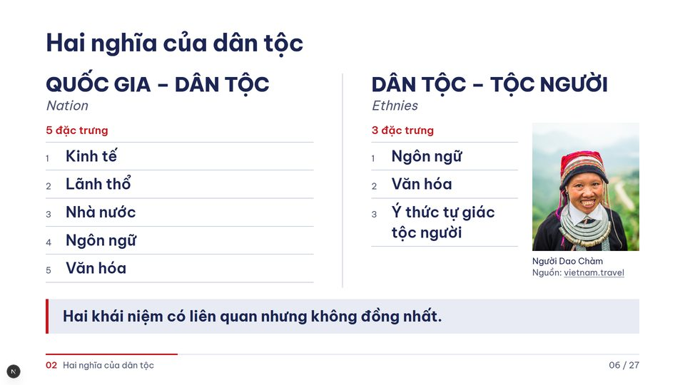

*Bấm sang bước này (mũi tên phải hoặc Space).*

> **Trên slide:** Cột phải hiện: Dân tộc – tộc người (Ethnies), 3 đặc trưng: Ngôn ngữ, Văn hóa, Ý thức tự giác tộc người. Dòng kết luận cuối màn hình: Hai khái niệm có liên quan nhưng không đồng nhất.
>
> **Ảnh:** Cạnh ba đặc trưng: Người Dao Chàm.

Nghĩa thứ hai là dân tộc – tộc người: một cộng đồng tộc người hình thành trong lịch sử, là một bộ phận của quốc gia. Tộc người có ba đặc trưng.

Thứ nhất là cộng đồng về ngôn ngữ, gồm cả ngôn ngữ nói và ngôn ngữ viết, hoặc chỉ riêng ngôn ngữ nói. Đây là tiêu chí cơ bản để phân biệt các tộc người. Thứ hai là cộng đồng về văn hóa, gồm văn hóa vật thể và phi vật thể, thể hiện qua phong tục, tập quán, trang phục, lễ hội. Thứ ba là ý thức tự giác tộc người, tức mỗi người tự nhận mình thuộc về tộc người nào, với tên gọi và nguồn gốc của tộc người đó. Đây là tiêu chí quan trọng nhất để phân định một tộc người. Bức ảnh bên cạnh là một phụ nữ người Dao Chàm trong trang phục truyền thống, một nét văn hóa riêng của người Dao.

Như dòng kết luận cuối màn hình, hai nghĩa này có liên quan nhưng không đồng nhất: tuy khác nhau nhưng gắn bó mật thiết, không thể tách rời. Dân tộc – tộc người là một bộ phận hợp thành của quốc gia – dân tộc; quan hệ giữa hai nghĩa là quan hệ giữa cái riêng và cái chung. Ví dụ, dân tộc Việt Nam là nghĩa thứ nhất, còn dân tộc Kinh, Tày, Thái, Dao là nghĩa thứ hai.

**Chuyển người:** Em xin hết phần khái niệm. Sau đây em xin mời bạn tiếp theo trình bày quan điểm của chủ nghĩa Mác – Lênin về vấn đề dân tộc.

## Thành viên 2 (màn 7 đến 11): Hai xu hướng khách quan và Cương lĩnh dân tộc

### Màn 7. Mở đầu phần 2

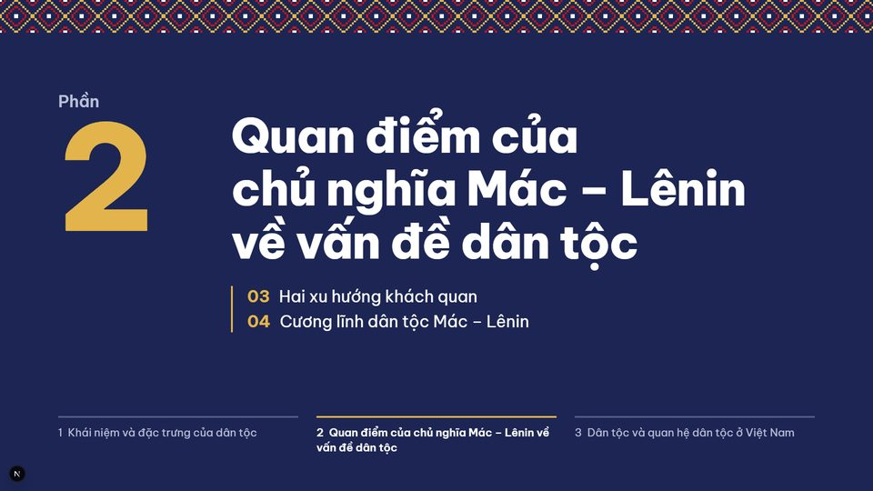

> **Trên slide:** Phần 2. Quan điểm của chủ nghĩa Mác – Lênin về vấn đề dân tộc. 03 Hai xu hướng khách quan. 04 Cương lĩnh dân tộc Mác – Lênin.
>
> **Ảnh:** không có ảnh.

Em xin trình bày phần hai: quan điểm của chủ nghĩa Mác – Lênin về vấn đề dân tộc. Phần này gồm hai nội dung: hai xu hướng khách quan trong sự phát triển quan hệ dân tộc, và Cương lĩnh dân tộc do Lênin khái quát.

### Màn 8. Hai xu hướng khách quan

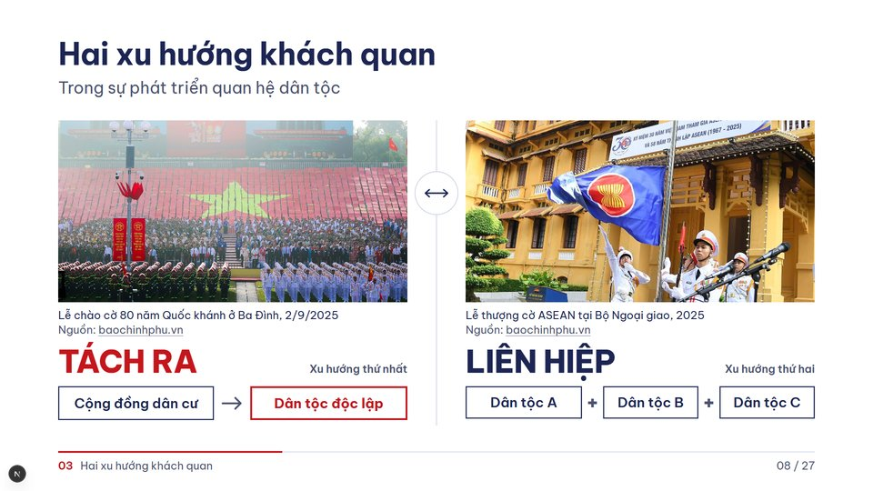

> **Trên slide:** Tiêu đề phụ: Trong sự phát triển quan hệ dân tộc. Cột trái: TÁCH RA (Xu hướng thứ nhất). Cộng đồng dân cư muốn hình thành cộng đồng dân tộc độc lập. Sơ đồ: Cộng đồng dân cư, mũi tên, Dân tộc độc lập. Cột phải: LIÊN HIỆP (Xu hướng thứ hai). Các dân tộc có nhu cầu liên hệ và liên hiệp với nhau. Sơ đồ: Dân tộc A + Dân tộc B + Dân tộc C. Giữa hai cột: mũi tên hai chiều.
>
> **Ảnh:** Bên trái: Nhân dân ở Ba Đình nghe Tuyên ngôn Độc lập, 2/9/1945; Bên phải: Lễ thượng cờ ASEAN tại Bộ Ngoại giao, 2025.

Khi nghiên cứu vấn đề dân tộc trong điều kiện chủ nghĩa tư bản, Lênin đã chỉ ra hai xu hướng khách quan trong sự phát triển quan hệ dân tộc.

Xu hướng thứ nhất là tách ra: cộng đồng dân cư muốn hình thành cộng đồng dân tộc độc lập. Nguyên nhân là sự thức tỉnh, trưởng thành của ý thức dân tộc, ý thức về quyền sống của mình. Xu hướng này thể hiện rõ trong phong trào đấu tranh giành độc lập của các dân tộc thuộc địa và phụ thuộc. Bức ảnh bên trái là nhân dân ở Ba Đình nghe Tuyên ngôn Độc lập ngày 2 tháng 9 năm 1945, khi dân tộc Việt Nam thoát khỏi ách thực dân và lập nên nhà nước độc lập.

Xu hướng thứ hai là liên hiệp: các dân tộc có nhu cầu liên hệ và liên hiệp với nhau. Xu hướng này nổi lên khi chủ nghĩa tư bản phát triển thành chủ nghĩa đế quốc: sự phát triển của lực lượng sản xuất, khoa học công nghệ và giao lưu kinh tế, văn hóa làm xuất hiện nhu cầu xóa bỏ hàng rào ngăn cách giữa các dân tộc. Ảnh bên phải là lễ thượng cờ ASEAN tại Bộ Ngoại giao năm 2025, ví dụ về sự liên kết giữa các quốc gia trong khu vực.

Mũi tên hai chiều ở giữa nhắc rằng hai xu hướng này cùng tồn tại và tác động qua lại. Ngày nay, các dân tộc vừa giữ vững độc lập, chủ quyền, vừa mở rộng hợp tác và hội nhập với nhau.

### Màn 9. Cương lĩnh dân tộc: bình đẳng

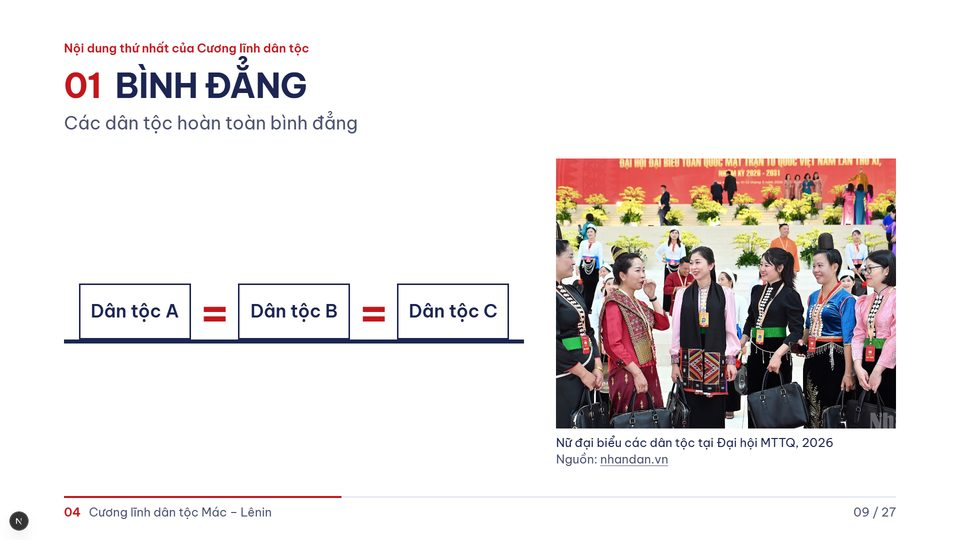

> **Trên slide:** Dòng dẫn: Nội dung thứ nhất của Cương lĩnh dân tộc. Tiêu đề: 01 BÌNH ĐẲNG. Các dân tộc hoàn toàn bình đẳng. Không có dân tộc nào được đặt ở vị trí cao hơn hoặc thấp hơn dân tộc khác. Sơ đồ: Dân tộc A = Dân tộc B = Dân tộc C, cùng trên một đường nền.
>
> **Ảnh:** Bên phải: Nữ đại biểu các dân tộc tại Đại hội MTTQ, 2026.

Dựa trên hai xu hướng đó và kinh nghiệm của phong trào cách mạng, Lênin đã khái quát Cương lĩnh dân tộc của chủ nghĩa Mác – Lênin gồm ba nội dung.

Nội dung thứ nhất: các dân tộc hoàn toàn bình đẳng. Đây là quyền thiêng liêng của các dân tộc, không phân biệt dân tộc lớn hay nhỏ, trình độ phát triển cao hay thấp. Không có dân tộc nào được đặt ở vị trí cao hơn hoặc thấp hơn dân tộc khác, như sơ đồ dân tộc A bằng dân tộc B bằng dân tộc C, cùng đứng trên một mặt bằng.

Bình đẳng nghĩa là các dân tộc có quyền lợi và nghĩa vụ ngang nhau trên mọi lĩnh vực, không dân tộc nào được giữ đặc quyền, đặc lợi, và không dân tộc nào được áp bức dân tộc khác. Quyền bình đẳng phải được pháp luật bảo vệ và phải được thực hiện trên thực tế, trong đó khắc phục sự chênh lệch về trình độ phát triển giữa các dân tộc có ý nghĩa cơ bản. Thực hiện quyền bình đẳng là cơ sở để thực hiện quyền dân tộc tự quyết. Ảnh bên phải là các nữ đại biểu thuộc nhiều dân tộc tại Đại hội Mặt trận Tổ quốc, cùng tham gia công việc chung của đất nước.

### Màn 10. Cương lĩnh dân tộc: quyền tự quyết

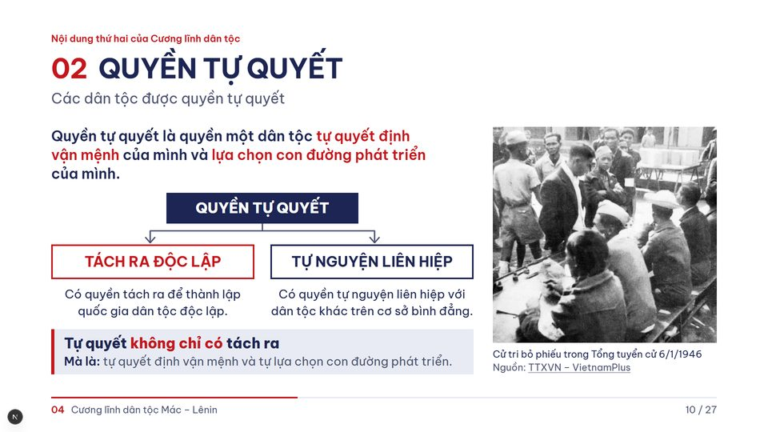

> **Trên slide:** Dòng dẫn: Nội dung thứ hai của Cương lĩnh dân tộc. Tiêu đề: 02 QUYỀN TỰ QUYẾT. Các dân tộc được quyền tự quyết. Định nghĩa: Quyền tự quyết là quyền một dân tộc tự quyết định vận mệnh của mình và lựa chọn con đường phát triển của mình. Hai nhánh: TÁCH RA ĐỘC LẬP (có quyền tách ra để thành lập quốc gia dân tộc độc lập) và TỰ NGUYỆN LIÊN HIỆP (có quyền tự nguyện liên hiệp với dân tộc khác trên cơ sở bình đẳng). Khung cuối: Tự quyết không chỉ có tách ra. Mà là: tự quyết định vận mệnh và tự lựa chọn con đường phát triển.
>
> **Ảnh:** Bên phải: Cử tri bỏ phiếu trong Tổng tuyển cử 6/1/1946.

Nội dung thứ hai: các dân tộc được quyền tự quyết. Quyền tự quyết là quyền làm chủ của mỗi dân tộc đối với vận mệnh dân tộc mình, quyền tự quyết định chế độ chính trị – xã hội và con đường phát triển của dân tộc mình.

Quyền này có hai nhánh như sơ đồ. Một là quyền tách ra để thành lập quốc gia dân tộc độc lập. Hai là quyền tự nguyện liên hiệp với dân tộc khác trên cơ sở bình đẳng.

Điều cần nhớ là tự quyết không chỉ có tách ra. Việc thực hiện quyền tự quyết phải xuất phát từ thực tiễn cụ thể và đứng vững trên lập trường của giai cấp công nhân. Quyền dân tộc tự quyết cũng không đồng nhất với “quyền” của các tộc người thiểu số trong một quốc gia đa tộc người, nhất là việc đòi tách ra thành quốc gia riêng; chúng ta cần cảnh giác khi các thế lực thù địch lợi dụng chiêu bài dân tộc tự quyết để can thiệp vào công việc nội bộ của các nước.

Ảnh bên phải là cử tri bỏ phiếu trong cuộc Tổng tuyển cử ngày 6 tháng 1 năm 1946, lần đầu tiên nhân dân ta tự bầu ra Quốc hội của mình, một biểu hiện rõ của quyền tự quyết.

### Màn 11. Cương lĩnh dân tộc: liên hiệp công nhân

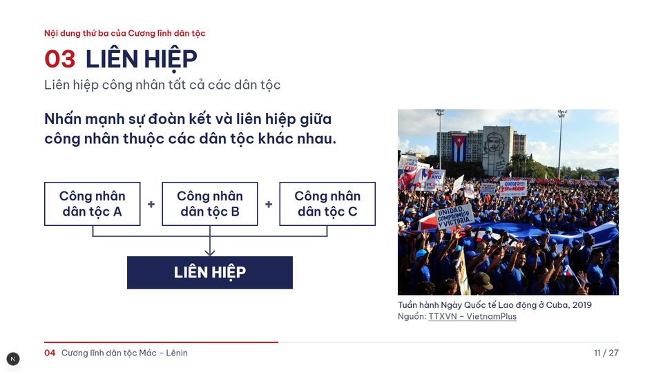

> **Trên slide:** Dòng dẫn: Nội dung thứ ba của Cương lĩnh dân tộc. Tiêu đề: 03 LIÊN HIỆP. Liên hiệp công nhân tất cả các dân tộc. Nhấn mạnh sự đoàn kết và liên hiệp giữa công nhân thuộc các dân tộc khác nhau. Sơ đồ: Công nhân dân tộc A, B, C cùng gom về ô LIÊN HIỆP.
>
> **Ảnh:** Bên phải: Tuần hành Ngày Quốc tế Lao động ở Cuba, 2019.

Nội dung thứ ba: liên hiệp công nhân tất cả các dân tộc. Nội dung này nhấn mạnh sự đoàn kết và liên hiệp giữa công nhân thuộc các dân tộc khác nhau, như sơ đồ công nhân dân tộc A, B, C cùng hướng về một khối liên hiệp.

Nội dung này phản ánh sự thống nhất giữa giải phóng dân tộc và giải phóng giai cấp, giữa chủ nghĩa yêu nước và chủ nghĩa quốc tế chân chính. Đoàn kết công nhân các dân tộc là cơ sở để đoàn kết nhân dân lao động các dân tộc trong cuộc đấu tranh vì độc lập dân tộc và tiến bộ xã hội. Vì vậy, đây vừa là nội dung chủ yếu, vừa là giải pháp quan trọng gắn ba nội dung của cương lĩnh thành một thể thống nhất. Ảnh bên phải là người lao động tuần hành Ngày Quốc tế Lao động ở Cuba năm 2019, trên tấm biển có chữ Unidad, nghĩa là đoàn kết.

Như vậy, Cương lĩnh dân tộc gồm ba nội dung: các dân tộc hoàn toàn bình đẳng, các dân tộc được quyền tự quyết, và liên hiệp công nhân tất cả các dân tộc. Đây là cơ sở lý luận để Đảng ta xây dựng chính sách dân tộc ở Việt Nam.

**Chuyển người:** Em xin hết phần quan điểm lý luận. Sau đây em xin mời bạn tiếp theo trình bày về dân tộc và quan hệ dân tộc ở Việt Nam.

## Thành viên 3 (màn 12 đến 17): Sáu đặc điểm dân tộc Việt Nam

### Màn 12. Mở đầu phần 3

> **Trên slide:** Phần 3. Dân tộc và quan hệ dân tộc ở Việt Nam. 05 Sáu đặc điểm dân tộc Việt Nam. 06 Quan điểm của Đảng, Nhà nước Việt Nam. 07 Chính sách dân tộc.
>
> **Ảnh:** Bên phải: Người H'Mông Đen.

Em xin trình bày phần ba: dân tộc và quan hệ dân tộc ở Việt Nam. Phần này có ba nội dung: sáu đặc điểm dân tộc Việt Nam, quan điểm của Đảng và Nhà nước, và chính sách dân tộc. Em xin trình bày sáu đặc điểm trước. Ảnh bên phải là một người đàn ông H'Mông Đen trong trang phục truyền thống.

### Màn 13. Sáu đặc điểm dân tộc Việt Nam, bước 1

> **Trên slide:** 01 Số dân, 02 Cư trú, 03 Địa bàn, 04 Phát triển, 05 Đoàn kết, 06 Văn hóa.
>
> **Ảnh:** không có ảnh.

Việt Nam là một quốc gia đa dân tộc với 54 dân tộc anh em. Dân tộc ở Việt Nam có sáu đặc điểm, ứng với sáu từ khóa trên màn hình: số dân, cư trú, địa bàn, phát triển, đoàn kết và văn hóa. Em xin đi lần lượt từng đặc điểm.

### Màn 14. Sáu đặc điểm dân tộc Việt Nam, bước 2: Dân cư và địa bàn

*Bấm sang bước này (mũi tên phải hoặc Space).*

> **Trên slide:** 01 Chênh lệch số dân: Quy mô dân số giữa các tộc người không giống nhau. 02 Cư trú xen kẽ: Nhiều cộng đồng dân tộc cùng sinh sống trên một địa bàn. 03 Địa bàn chiến lược: Các dân tộc thiểu số phân bố chủ yếu tại các địa bàn có vị trí chiến lược quan trọng.
>
> **Ảnh:** Bên phải, cao hết slide: Atlat Địa lí Việt Nam (số liệu năm 1999).

Ba đặc điểm đầu liên quan đến dân cư và địa bàn.

Thứ nhất là chênh lệch số dân: quy mô dân số giữa các tộc người không giống nhau. Theo số liệu trong giáo trình, dân tộc Kinh có hơn 73,5 triệu người, chiếm 85,7% dân số; 53 dân tộc thiểu số có hơn 12,2 triệu người, chiếm 14,3%. Có dân tộc trên một triệu người như Tày, Thái, Mường, Khmer, Mông, nhưng cũng có dân tộc chỉ vài trăm người như Si La, Pu Péo, Rơ Măm, Brâu, Ơ Đu. Dân tộc càng ít người thì càng khó giữ gìn tiếng nói, văn hóa và duy trì giống nòi, nên Nhà nước có chính sách quan tâm đặc biệt.

Thứ hai là cư trú xen kẽ: nhiều cộng đồng dân tộc cùng sinh sống trên một địa bàn, không dân tộc nào có lãnh thổ riêng. Điều này giúp các dân tộc hiểu nhau, giao lưu và giúp đỡ nhau cùng phát triển, nhưng trong quá trình sinh sống cũng có thể nảy sinh mâu thuẫn mà các thế lực thù địch có thể lợi dụng.

Thứ ba là địa bàn chiến lược: các dân tộc thiểu số phân bố chủ yếu tại các địa bàn có vị trí chiến lược quan trọng. Dù chỉ chiếm 14,3% dân số, đồng bào dân tộc thiểu số cư trú trên khoảng ba phần tư diện tích lãnh thổ, nhiều nơi là biên giới, vùng núi, hải đảo, quan trọng cả về kinh tế, an ninh, quốc phòng và môi trường sinh thái. Bản đồ bên phải lấy từ Atlat Địa lí Việt Nam cho thấy sự phân bố của các dân tộc trên cả nước.

### Màn 15. Sáu đặc điểm dân tộc Việt Nam, bước 3: Phát triển và đoàn kết

*Bấm sang bước này (mũi tên phải hoặc Space).*

> **Trên slide:** 04 Phát triển không đồng đều: Trình độ phát triển giữa các dân tộc có sự khác nhau. 05 Đoàn kết lâu đời: Các dân tộc gắn bó trong cộng đồng dân tộc – quốc gia thống nhất.
>
> **Ảnh:** Bên phải: Ngày hội Đại đoàn kết ở Nà Cốc, Cao Bằng, 2025.

Đặc điểm thứ tư là phát triển không đồng đều: trình độ phát triển giữa các dân tộc có sự khác nhau, cả về kinh tế, văn hóa và xã hội. Ở nhiều vùng dân tộc thiểu số, đời sống và trình độ dân trí còn thấp so với mặt bằng chung. Vì vậy, muốn thực hiện bình đẳng dân tộc thì phải từng bước thu hẹp, tiến tới xóa bỏ khoảng cách phát triển này.

Đặc điểm thứ năm là đoàn kết lâu đời: các dân tộc gắn bó trong cộng đồng dân tộc – quốc gia thống nhất. Truyền thống này hình thành từ rất sớm, do nhu cầu cùng nhau chinh phục thiên nhiên và chống giặc ngoại xâm. Đoàn kết dân tộc là truyền thống quý báu, là một trong những nguyên nhân quyết định mọi thắng lợi của dân tộc ta trong lịch sử. Ảnh bên phải là Ngày hội Đại đoàn kết ở Nà Cốc, Cao Bằng năm 2025.

### Màn 16. Bản sắc văn hóa riêng

> **Trên slide:** Dòng dẫn: Sáu đặc điểm dân tộc Việt Nam. Tiêu đề: 06 Bản sắc văn hóa riêng. Mỗi dân tộc có bản sắc riêng và cùng góp phần tạo nên sự đa dạng của văn hóa Việt Nam.
>
> **Ảnh:** Bên trái: Thêu hoa văn trên trang phục truyền thống; Bên phải: Người Chăm biểu diễn nhạc cụ truyền thống.

Đặc điểm thứ sáu là bản sắc văn hóa riêng: mỗi dân tộc có bản sắc riêng và cùng góp phần tạo nên sự đa dạng của văn hóa Việt Nam. Bản sắc đó thể hiện qua ngôn ngữ, trang phục, nhà ở, lễ hội, âm nhạc, phong tục tập quán. Hai bức ảnh là hai ví dụ: bên trái là thêu hoa văn trên trang phục truyền thống, bên phải là người Chăm biểu diễn nhạc cụ truyền thống bên tháp cổ. Những sắc thái riêng ấy cùng làm nên một nền văn hóa Việt Nam thống nhất trong đa dạng.

### Màn 17. Đa dạng về bản sắc, thống nhất trong cộng đồng quốc gia

> **Trên slide:** Dòng dẫn: Sáu đặc điểm dân tộc Việt Nam. ĐA DẠNG VỀ BẢN SẮC, nhưng THỐNG NHẤT TRONG CỘNG ĐỒNG QUỐC GIA.
>
> **Ảnh:** Bên trái: Người Dao Đỏ.

Tóm lại, sáu đặc điểm cho thấy các dân tộc Việt Nam đa dạng về bản sắc nhưng thống nhất trong cộng đồng quốc gia. Sáu đặc điểm đó là: chênh lệch số dân, cư trú xen kẽ, địa bàn chiến lược, phát triển không đồng đều, đoàn kết lâu đời và bản sắc văn hóa riêng. Ảnh bên trái là một phụ nữ người Dao Đỏ.

Chính từ những đặc điểm này, Đảng và Nhà nước ta luôn coi vấn đề dân tộc là vấn đề chính trị – xã hội rộng lớn và toàn diện, gắn với các mục tiêu của thời kỳ quá độ lên chủ nghĩa xã hội.

**Chuyển người:** Từ những đặc điểm vừa trình bày, em xin mời bạn tiếp theo trình bày quan điểm của Đảng và Nhà nước về vấn đề dân tộc.

## Thành viên 4 (màn 18 đến 20): Quan điểm của Đảng và Nhà nước về vấn đề dân tộc

### Màn 18. Quan điểm 1: Vấn đề dân tộc là vấn đề chiến lược

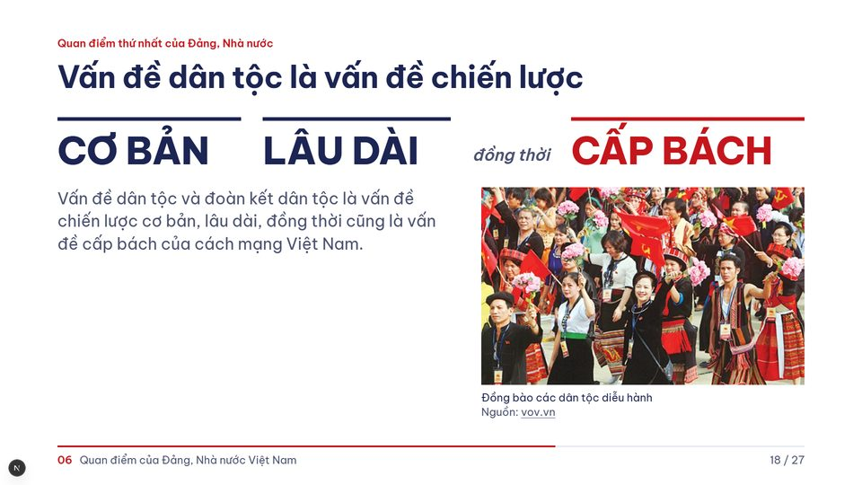

> **Trên slide:** Dòng dẫn: Quan điểm thứ nhất của Đảng, Nhà nước. Ba từ khóa: CƠ BẢN, LÂU DÀI, đồng thời CẤP BÁCH. Vấn đề dân tộc và đoàn kết dân tộc là vấn đề chiến lược cơ bản, lâu dài, đồng thời cũng là vấn đề cấp bách của cách mạng Việt Nam.
>
> **Ảnh:** Bên phải: Đồng bào các dân tộc diễu hành.

Em xin trình bày quan điểm của Đảng và Nhà nước Việt Nam về vấn đề dân tộc. Năm quan điểm cơ bản được nêu trong Nghị quyết 24 của Hội nghị Trung ương 7 khóa IX năm 2003 về công tác dân tộc.

Quan điểm thứ nhất: vấn đề dân tộc và đoàn kết dân tộc là vấn đề chiến lược cơ bản, lâu dài, đồng thời cũng là vấn đề cấp bách của cách mạng Việt Nam. Ba từ khóa cần nhớ là cơ bản, lâu dài và cấp bách.

Cơ bản và lâu dài vì vấn đề dân tộc gắn với sự tồn tại và phát triển của đất nước, phải được giải quyết trong suốt quá trình đi lên chủ nghĩa xã hội. Cấp bách vì đời sống của một bộ phận đồng bào dân tộc thiểu số còn nhiều khó khăn, trong khi các thế lực thù địch vẫn tìm cách lợi dụng vấn đề dân tộc để chia rẽ khối đại đoàn kết. Ảnh bên phải là đồng bào các dân tộc trong trang phục truyền thống diễu hành.

### Màn 19. Quan điểm 2: Quan hệ giữa các dân tộc

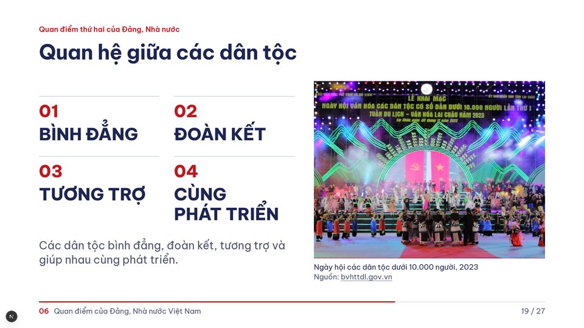

> **Trên slide:** Dòng dẫn: Quan điểm thứ hai của Đảng, Nhà nước. 01 BÌNH ĐẲNG, 02 ĐOÀN KẾT, 03 TƯƠNG TRỢ, 04 CÙNG PHÁT TRIỂN. Các dân tộc bình đẳng, đoàn kết, tương trợ và giúp nhau cùng phát triển.
>
> **Ảnh:** Bên phải: Ngày hội các dân tộc dưới 10.000 người, 2023.

Quan điểm thứ hai nói về quan hệ giữa các dân tộc: các dân tộc trong đại gia đình Việt Nam bình đẳng, đoàn kết, tương trợ và giúp nhau cùng phát triển, cùng phấn đấu thực hiện công nghiệp hóa, hiện đại hóa, xây dựng và bảo vệ Tổ quốc. Đồng thời, phải kiên quyết đấu tranh với mọi âm mưu chia rẽ dân tộc.

Ảnh bên phải là Ngày hội văn hóa các dân tộc có số dân dưới mười nghìn người, tổ chức năm 2023. Ngày hội cho thấy cả những dân tộc rất ít người cũng được tôn vinh và bình đẳng như mọi dân tộc khác.

### Màn 20. Quan điểm 3, 4, 5: Ba hướng thực hiện

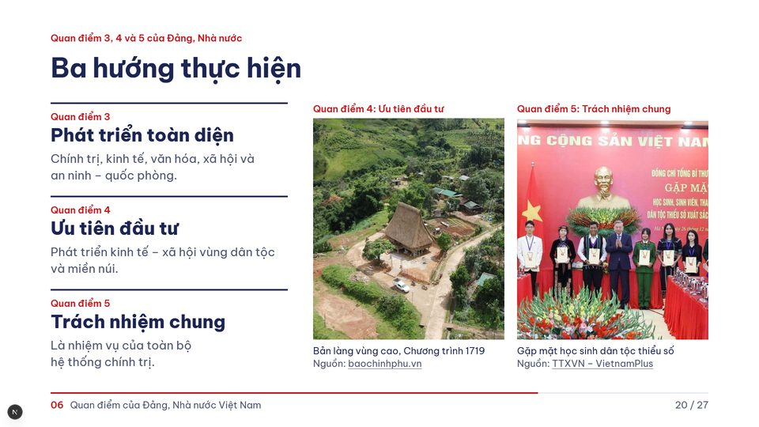

> **Trên slide:** Dòng dẫn: Quan điểm 3, 4 và 5 của Đảng, Nhà nước. Quan điểm 3, Phát triển toàn diện: Chính trị, kinh tế, văn hóa, xã hội và an ninh – quốc phòng. Quan điểm 4, Ưu tiên đầu tư: Phát triển kinh tế – xã hội vùng dân tộc và miền núi. Quan điểm 5, Trách nhiệm chung: Là nhiệm vụ của toàn bộ hệ thống chính trị.
>
> **Ảnh:** Ảnh có nhãn Quan điểm 4: Bản làng vùng cao, Chương trình 1719; Ảnh có nhãn Quan điểm 5: Gặp mặt học sinh dân tộc thiểu số.

Ba quan điểm còn lại là ba hướng thực hiện.

Quan điểm thứ ba là phát triển toàn diện chính trị, kinh tế, văn hóa, xã hội và an ninh – quốc phòng trên địa bàn vùng dân tộc và miền núi; gắn tăng trưởng kinh tế với giải quyết các vấn đề xã hội; chăm lo đào tạo cán bộ là người dân tộc thiểu số; giữ gìn và phát huy bản sắc văn hóa các dân tộc.

Quan điểm thứ tư là ưu tiên đầu tư phát triển kinh tế – xã hội vùng dân tộc và miền núi, trước hết là giao thông, cơ sở hạ tầng và xóa đói giảm nghèo, đi đôi với phát huy tinh thần tự lực, tự cường của đồng bào. Ảnh có nhãn quan điểm 4 là một bản làng vùng cao được đầu tư theo Chương trình 1719, tức chương trình mục tiêu quốc gia phát triển kinh tế – xã hội vùng đồng bào dân tộc thiểu số và miền núi, có nhà văn hóa và đường bê tông mới.

Quan điểm thứ năm: công tác dân tộc và thực hiện chính sách dân tộc là nhiệm vụ của toàn Đảng, toàn dân, toàn quân, của các cấp, các ngành và toàn bộ hệ thống chính trị. Ảnh có nhãn quan điểm 5 là buổi gặp mặt học sinh, sinh viên dân tộc thiểu số tiêu biểu.

Như vậy, năm quan điểm đã làm rõ vị trí của vấn đề dân tộc, quan hệ giữa các dân tộc, hướng phát triển và trách nhiệm thực hiện.

**Chuyển người:** Em xin mời bạn tiếp theo trình bày phần cuối: chính sách dân tộc.

## Thành viên 5 (màn 21 đến 27): Chính sách dân tộc, tổng kết, trò chơi và lời cảm ơn

### Màn 21. Chính sách dân tộc, lĩnh vực 1/5: Chính trị

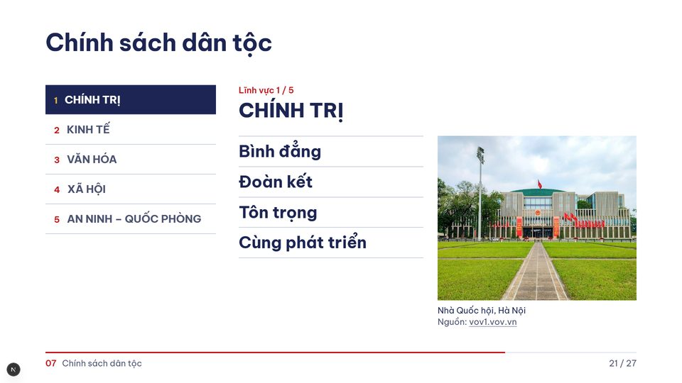

> **Trên slide:** Bên trái: danh sách năm lĩnh vực (Chính trị, Kinh tế, Văn hóa, Xã hội, An ninh – Quốc phòng), đang chọn Chính trị. Bình đẳng, Đoàn kết, Tôn trọng, Cùng phát triển.
>
> **Ảnh:** Bên phải: Nhà Quốc hội, Hà Nội.

Em xin trình bày phần cuối: chính sách dân tộc. Từ năm quan điểm vừa nêu, chính sách dân tộc được cụ thể hóa trên năm lĩnh vực, như danh sách bên trái màn hình.

Lĩnh vực thứ nhất là chính trị: thực hiện bình đẳng, đoàn kết, tôn trọng và giúp nhau cùng phát triển giữa các dân tộc. Chính sách này nâng cao tính tích cực chính trị của đồng bào các dân tộc, giúp đồng bào hiểu rõ tầm quan trọng của đoàn kết dân tộc và thống nhất mục tiêu chung: độc lập dân tộc và chủ nghĩa xã hội, dân giàu, nước mạnh, dân chủ, công bằng, văn minh. Ảnh bên phải là Nhà Quốc hội ở Hà Nội, nơi đại biểu của các dân tộc cùng quyết định những vấn đề hệ trọng của đất nước.

### Màn 22. Chính sách dân tộc, lĩnh vực 2/5: Kinh tế

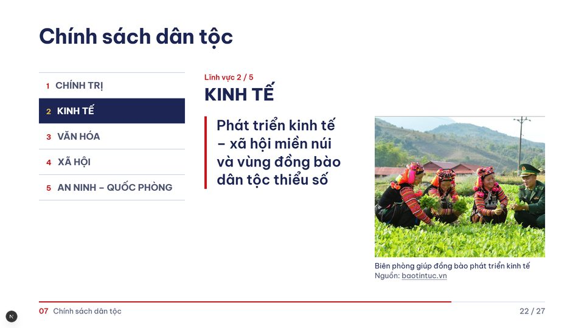

*Bấm sang bước này (mũi tên phải hoặc Space).*

> **Trên slide:** Phát triển kinh tế – xã hội miền núi và vùng đồng bào dân tộc thiểu số.
>
> **Ảnh:** Bên phải: Biên phòng giúp đồng bào phát triển kinh tế.

Lĩnh vực thứ hai là kinh tế: các chủ trương, chính sách phát triển kinh tế – xã hội miền núi và vùng đồng bào dân tộc thiểu số, nhằm phát huy tiềm năng của từng vùng và từng bước thu hẹp khoảng cách phát triển giữa các vùng, các dân tộc. Chính sách được thực hiện qua các chương trình, dự án phát triển kinh tế ở vùng đồng bào dân tộc thiểu số. Ảnh bên phải là cán bộ biên phòng giúp đồng bào phát triển kinh tế.

### Màn 23. Chính sách dân tộc, lĩnh vực 3/5: Văn hóa

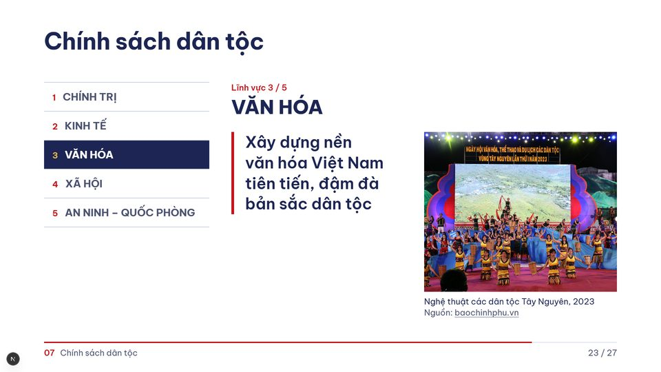

*Bấm sang bước này (mũi tên phải hoặc Space).*

> **Trên slide:** Xây dựng nền văn hóa Việt Nam tiên tiến, đậm đà bản sắc dân tộc.
>
> **Ảnh:** Bên phải: Nghệ thuật các dân tộc Tây Nguyên, 2023.

Lĩnh vực thứ ba là văn hóa: xây dựng nền văn hóa Việt Nam tiên tiến, đậm đà bản sắc dân tộc. Cụ thể là giữ gìn và phát huy giá trị văn hóa truyền thống của các dân tộc, phát triển ngôn ngữ, xây dựng đời sống văn hóa ở cơ sở, nâng cao trình độ văn hóa cho nhân dân các dân tộc; mở rộng giao lưu văn hóa với các nước; đồng thời đấu tranh chống tệ nạn xã hội và chống “diễn biến hòa bình” trên mặt trận tư tưởng – văn hóa. Ảnh bên phải là chương trình nghệ thuật của các dân tộc Tây Nguyên năm 2023.

### Màn 24. Chính sách dân tộc, lĩnh vực 4/5: Xã hội

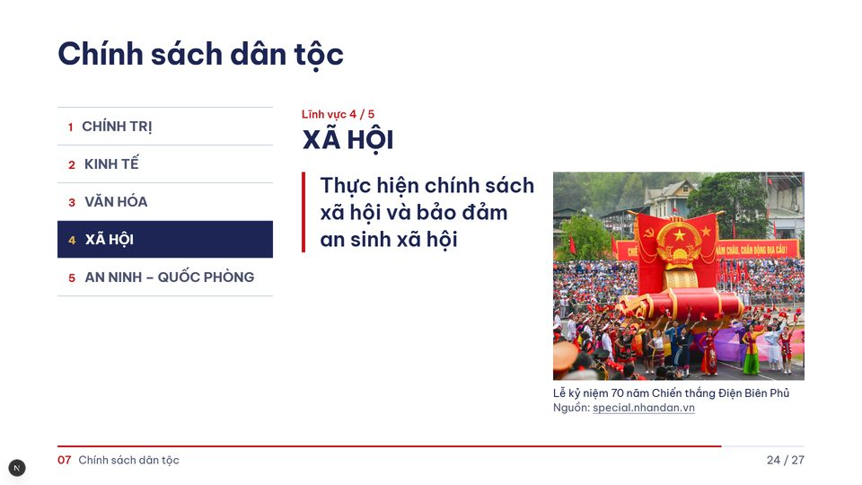

*Bấm sang bước này (mũi tên phải hoặc Space).*

> **Trên slide:** Thực hiện chính sách xã hội và bảo đảm an sinh xã hội.
>
> **Ảnh:** Bên phải: Lễ kỷ niệm 70 năm Chiến thắng Điện Biên Phủ.

Lĩnh vực thứ tư là xã hội: thực hiện chính sách xã hội và bảo đảm an sinh xã hội trong vùng đồng bào dân tộc thiểu số. Đó là từng bước thực hiện công bằng xã hội qua các chính sách xóa đói giảm nghèo, dân số, y tế, giáo dục, có chú ý đến đặc thù của từng vùng, từng dân tộc. Ảnh bên phải là thanh niên các dân tộc trong lễ kỷ niệm 70 năm Chiến thắng Điện Biên Phủ.

### Màn 25. Chính sách dân tộc, lĩnh vực 5/5: An ninh – Quốc phòng

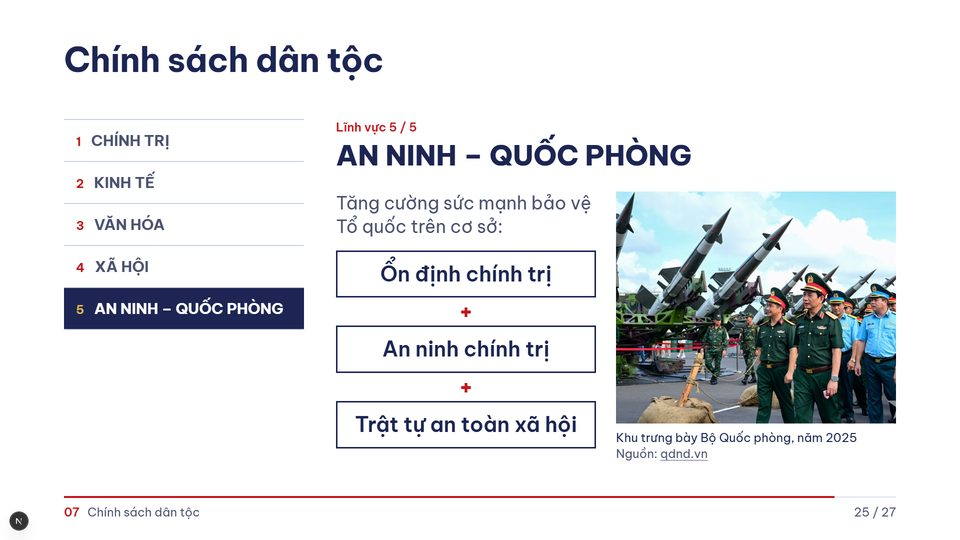

*Bấm sang bước này (mũi tên phải hoặc Space).*

> **Trên slide:** Tăng cường sức mạnh bảo vệ Tổ quốc trên cơ sở: Ổn định chính trị + An ninh chính trị + Trật tự an toàn xã hội.
>
> **Ảnh:** Bên phải: Khu trưng bày Bộ Quốc phòng, năm 2025.

Lĩnh vực cuối cùng là an ninh – quốc phòng: tăng cường sức mạnh bảo vệ Tổ quốc trên cơ sở bảo đảm ổn định chính trị, thực hiện tốt an ninh chính trị và trật tự an toàn xã hội. Vùng đồng bào dân tộc thiểu số phần lớn là biên giới, địa bàn chiến lược, nên cần phối hợp chặt chẽ các lực lượng, tăng cường quan hệ quân dân và xây dựng thế trận quốc phòng toàn dân ở đây. Ảnh bên phải là khu trưng bày của Bộ Quốc phòng năm 2025.

Tóm lại, nhóm em đã trình bày ba phần: khái niệm và đặc trưng của dân tộc; quan điểm của chủ nghĩa Mác – Lênin về vấn đề dân tộc; và dân tộc, quan hệ dân tộc ở Việt Nam. Chính sách dân tộc của Đảng và Nhà nước mang tính toàn diện, tổng hợp, bao trùm năm lĩnh vực chính trị, kinh tế, văn hóa, xã hội và an ninh – quốc phòng, nhằm xây dựng khối đại đoàn kết toàn dân tộc vững chắc.

### Màn 26. Trò chơi: Đường đua đại đoàn kết

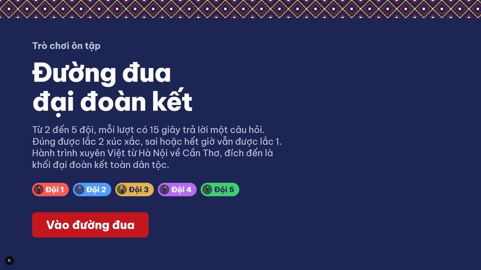

> **Trên slide:** Trò chơi ôn tập. Đường đua đại đoàn kết. Từ 2 đến 5 đội, mỗi lượt có 15 giây trả lời một câu hỏi. Đúng được lắc 2 xúc xắc, sai hoặc hết giờ vẫn được lắc 1. Hành trình xuyên Việt từ Hà Nội về Cần Thơ, đích đến là khối đại đoàn kết toàn dân tộc. Nút: Vào đường đua.
>
> **Ảnh:** không có ảnh.

Để ôn lại bài, nhóm em có một trò chơi nhỏ tên là Đường đua đại đoàn kết. Lớp mình chia thành hai đến năm đội. Mỗi lượt, đội chơi có 15 giây để trả lời một câu hỏi trắc nghiệm về nội dung vừa trình bày. Trả lời đúng được lắc hai xúc xắc, sai hoặc hết giờ vẫn được lắc một. Dừng ở ô có hộp quà thì được mở một thẻ bất ngờ. Đội về đích đầu tiên sẽ thắng. Mời các đội vào đường đua.

### Màn 27. Cảm ơn

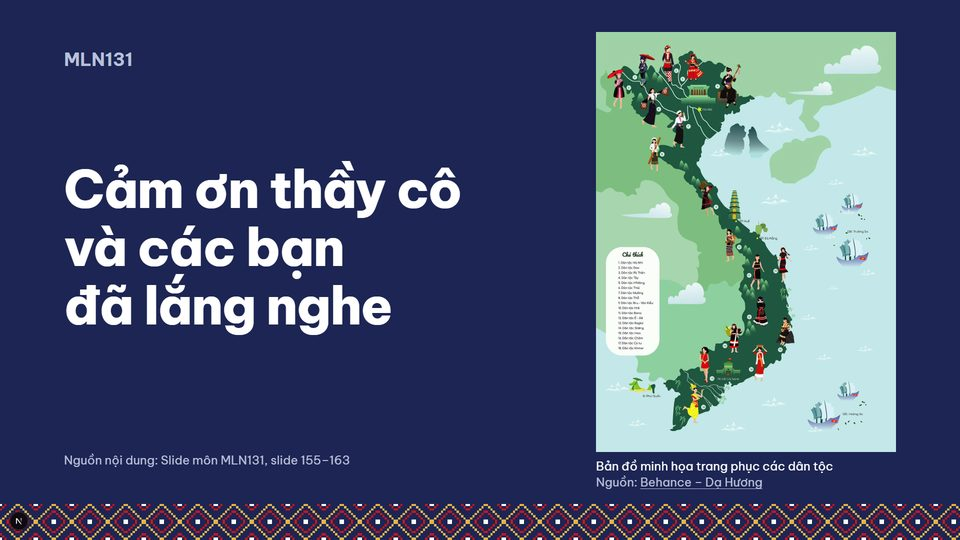

> **Trên slide:** Cảm ơn thầy cô và các bạn đã lắng nghe. Nguồn nội dung: Slide môn MLN131, slide 155–163.
>
> **Ảnh:** Bên phải: Bản đồ minh họa trang phục các dân tộc.

Bài thuyết trình của nhóm em đến đây là hết. Nhóm em rất mong nhận được góp ý của thầy cô và các bạn. Em xin cảm ơn thầy cô và các bạn đã lắng nghe.

## Phụ lục

### Cách dùng kịch bản

- Mỗi lần bấm là sang một màn. Màn 5 và 6, màn 13 đến 15, màn 21 đến 25 là các bước của cùng một slide: bố cục giữ nguyên, chỉ phần nội dung đổi.
- Câu nào nhắc tới ảnh thì ảnh đó nằm đúng vị trí ghi ở dòng **Ảnh** của màn đó.
- Lời nói này cũng hiện ở màn hình người trình bày trên web (phím N khi đang chiếu, hoặc trang /presenter).

### Cách gọi thống nhất

| Nội dung | Gọi là |
| --- | --- |
| Hai nghĩa của dân tộc | quốc gia – dân tộc; dân tộc – tộc người |
| Hai xu hướng khách quan | xu hướng tách ra; xu hướng liên hiệp |
| Cương lĩnh dân tộc của chủ nghĩa Mác – Lênin | các dân tộc hoàn toàn bình đẳng; các dân tộc được quyền tự quyết; liên hiệp công nhân tất cả các dân tộc |
| Sáu đặc điểm dân tộc Việt Nam | chênh lệch số dân; cư trú xen kẽ; địa bàn chiến lược; phát triển không đồng đều; đoàn kết lâu đời; bản sắc văn hóa riêng |
| Quan điểm của Đảng và Nhà nước | quan điểm thứ nhất đến quan điểm thứ năm |
| Chính sách dân tộc | chính trị; kinh tế; văn hóa; xã hội; an ninh – quốc phòng |

### Những chỗ đã sửa so với bản Word

- Lời nói giải thích đầy đủ từng ý trên slide theo giáo trình Chủ nghĩa xã hội khoa học (chương Vấn đề dân tộc), có ví dụ và số liệu, thay cho bản Word chỉ đọc lại ý chính.
- Bỏ các câu nói về cách làm slide hoặc về tài liệu, như "nhóm giữ nguyên cụm từ…", "trên slide nhóm tách…", "hai nội dung đọc rõ được trong ảnh tài liệu…", và bớt lặp "theo tài liệu".
- Chia lời theo 27 màn hình của bài trên web thay cho 15 slide của bản Word; mỗi màn chỉ nói đúng phần đang chiếu.
- Bổ sung nội dung thứ ba của Cương lĩnh dân tộc (liên hiệp công nhân tất cả các dân tộc), định nghĩa và hai nhánh của quyền tự quyết, vì slide đã có những nội dung này.
- Thêm câu giới thiệu ảnh ở những màn có ảnh, ghi rõ ảnh nằm bên nào.
- Lời kết bài ở màn 25, lời cảm ơn ở màn 27, vì màn trò chơi nằm giữa phần chính sách và lời cảm ơn.

### Đối chiếu với giáo trình

Lời nói đã đối chiếu với giáo trình Chủ nghĩa xã hội khoa học, chương 6, mục I (Dân tộc trong thời kỳ quá độ lên chủ nghĩa xã hội): khái niệm và đặc trưng của dân tộc, hai xu hướng khách quan, Cương lĩnh dân tộc, sáu đặc điểm dân tộc Việt Nam, năm quan điểm (Nghị quyết 24-NQ/TW năm 2003) và chính sách dân tộc trên năm lĩnh vực.

- Màn 14: số liệu dân số theo giáo trình (Tổng điều tra năm 2009: Kinh 85,7%, 53 dân tộc thiểu số 14,3%). Nếu thầy cô hỏi số liệu mới nhất: Tổng điều tra năm 2019 là Kinh 85,3%, dân tộc thiểu số 14,7%; dân tộc ít người nhất là Ơ Đu, 428 người.
- Phần giải thích thêm ngoài giáo trình (ví dụ dân tộc Việt Nam hình thành sớm do nhu cầu trị thủy và chống ngoại xâm, lý do vấn đề dân tộc vừa lâu dài vừa cấp bách, các câu giới thiệu ảnh) chỉ để minh họa; khi bị hỏi, trả lời theo ý của giáo trình.
