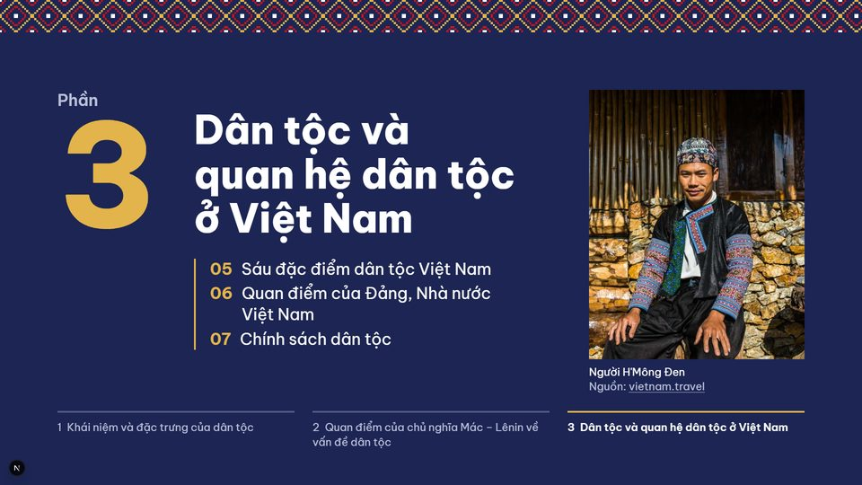
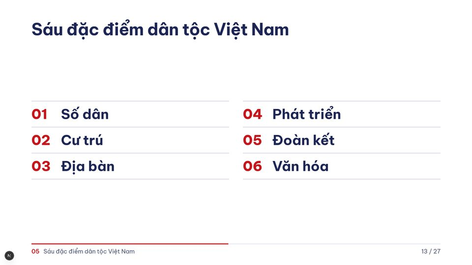
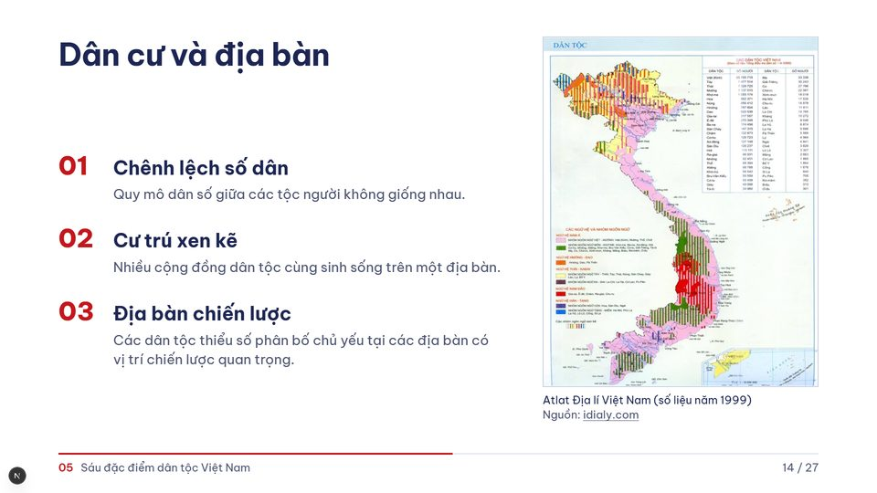
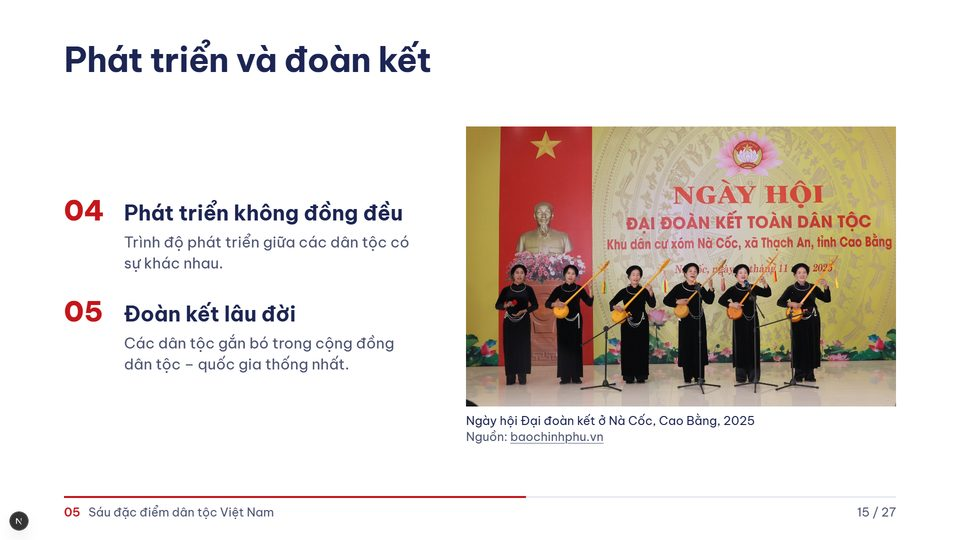
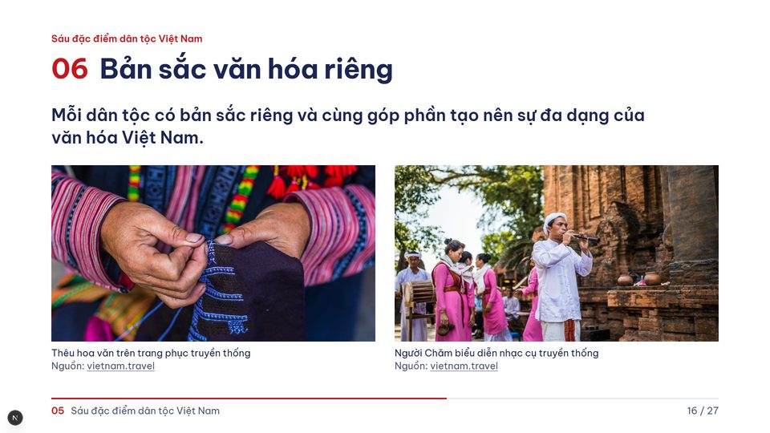
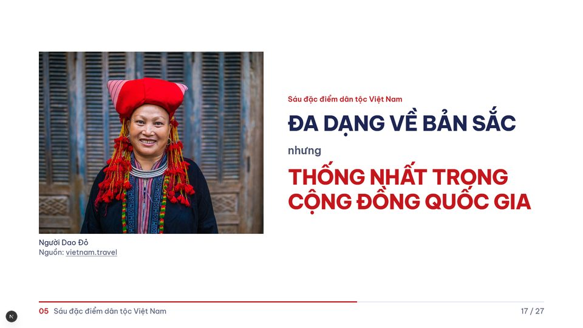

# Thành viên 3 (màn 12 đến 17): Sáu đặc điểm dân tộc Việt Nam

Thời lượng nói khoảng 5 phút. Kịch bản của cả nhóm: [kich-ban-thuyet-trinh.md](../kich-ban-thuyet-trinh.md).

Bạn bắt đầu sau câu chuyển người của thành viên 2: *Em xin hết phần quan điểm lý luận. Sau đây em xin mời bạn tiếp theo trình bày về dân tộc và quan hệ dân tộc ở Việt Nam.*

## Màn 12. Mở đầu phần 3

> **Trên slide:** Phần 3. Dân tộc và quan hệ dân tộc ở Việt Nam. 05 Sáu đặc điểm dân tộc Việt Nam. 06 Quan điểm của Đảng, Nhà nước Việt Nam. 07 Chính sách dân tộc.
>
> **Ảnh:** Bên phải: Người H'Mông Đen.

Em xin trình bày phần ba: dân tộc và quan hệ dân tộc ở Việt Nam. Phần này có ba nội dung: sáu đặc điểm dân tộc Việt Nam, quan điểm của Đảng và Nhà nước, và chính sách dân tộc. Em xin trình bày sáu đặc điểm trước. Ảnh bên phải là một người đàn ông H'Mông Đen trong trang phục truyền thống.

## Màn 13. Sáu đặc điểm dân tộc Việt Nam, bước 1

> **Trên slide:** 01 Số dân, 02 Cư trú, 03 Địa bàn, 04 Phát triển, 05 Đoàn kết, 06 Văn hóa.
>
> **Ảnh:** không có ảnh.

Việt Nam là một quốc gia đa dân tộc với 54 dân tộc anh em. Dân tộc ở Việt Nam có sáu đặc điểm, ứng với sáu từ khóa trên màn hình: số dân, cư trú, địa bàn, phát triển, đoàn kết và văn hóa. Em xin đi lần lượt từng đặc điểm.

## Màn 14. Sáu đặc điểm dân tộc Việt Nam, bước 2: Dân cư và địa bàn

*Bấm sang bước này (mũi tên phải hoặc Space).*

> **Trên slide:** 01 Chênh lệch số dân: Quy mô dân số giữa các tộc người không giống nhau. 02 Cư trú xen kẽ: Nhiều cộng đồng dân tộc cùng sinh sống trên một địa bàn. 03 Địa bàn chiến lược: Các dân tộc thiểu số phân bố chủ yếu tại các địa bàn có vị trí chiến lược quan trọng.
>
> **Ảnh:** Bên phải, cao hết slide: Atlat Địa lí Việt Nam (số liệu năm 1999).

Ba đặc điểm đầu liên quan đến dân cư và địa bàn.

Thứ nhất là chênh lệch số dân: quy mô dân số giữa các tộc người không giống nhau. Theo số liệu trong giáo trình, dân tộc Kinh có hơn 73,5 triệu người, chiếm 85,7% dân số; 53 dân tộc thiểu số có hơn 12,2 triệu người, chiếm 14,3%. Có dân tộc trên một triệu người như Tày, Thái, Mường, Khmer, Mông, nhưng cũng có dân tộc chỉ vài trăm người như Si La, Pu Péo, Rơ Măm, Brâu, Ơ Đu. Dân tộc càng ít người thì càng khó giữ gìn tiếng nói, văn hóa và duy trì giống nòi, nên Nhà nước có chính sách quan tâm đặc biệt.

Thứ hai là cư trú xen kẽ: nhiều cộng đồng dân tộc cùng sinh sống trên một địa bàn, không dân tộc nào có lãnh thổ riêng. Điều này giúp các dân tộc hiểu nhau, giao lưu và giúp đỡ nhau cùng phát triển, nhưng trong quá trình sinh sống cũng có thể nảy sinh mâu thuẫn mà các thế lực thù địch có thể lợi dụng.

Thứ ba là địa bàn chiến lược: các dân tộc thiểu số phân bố chủ yếu tại các địa bàn có vị trí chiến lược quan trọng. Dù chỉ chiếm 14,3% dân số, đồng bào dân tộc thiểu số cư trú trên khoảng ba phần tư diện tích lãnh thổ, nhiều nơi là biên giới, vùng núi, hải đảo, quan trọng cả về kinh tế, an ninh, quốc phòng và môi trường sinh thái. Bản đồ bên phải lấy từ Atlat Địa lí Việt Nam cho thấy sự phân bố của các dân tộc trên cả nước.

## Màn 15. Sáu đặc điểm dân tộc Việt Nam, bước 3: Phát triển và đoàn kết

*Bấm sang bước này (mũi tên phải hoặc Space).*

> **Trên slide:** 04 Phát triển không đồng đều: Trình độ phát triển giữa các dân tộc có sự khác nhau. 05 Đoàn kết lâu đời: Các dân tộc gắn bó trong cộng đồng dân tộc – quốc gia thống nhất.
>
> **Ảnh:** Bên phải: Ngày hội Đại đoàn kết ở Nà Cốc, Cao Bằng, 2025.

Đặc điểm thứ tư là phát triển không đồng đều: trình độ phát triển giữa các dân tộc có sự khác nhau, cả về kinh tế, văn hóa và xã hội. Ở nhiều vùng dân tộc thiểu số, đời sống và trình độ dân trí còn thấp so với mặt bằng chung. Vì vậy, muốn thực hiện bình đẳng dân tộc thì phải từng bước thu hẹp, tiến tới xóa bỏ khoảng cách phát triển này.

Đặc điểm thứ năm là đoàn kết lâu đời: các dân tộc gắn bó trong cộng đồng dân tộc – quốc gia thống nhất. Truyền thống này hình thành từ rất sớm, do nhu cầu cùng nhau chinh phục thiên nhiên và chống giặc ngoại xâm. Đoàn kết dân tộc là truyền thống quý báu, là một trong những nguyên nhân quyết định mọi thắng lợi của dân tộc ta trong lịch sử. Ảnh bên phải là Ngày hội Đại đoàn kết ở Nà Cốc, Cao Bằng năm 2025.

## Màn 16. Bản sắc văn hóa riêng

> **Trên slide:** Dòng dẫn: Sáu đặc điểm dân tộc Việt Nam. Tiêu đề: 06 Bản sắc văn hóa riêng. Mỗi dân tộc có bản sắc riêng và cùng góp phần tạo nên sự đa dạng của văn hóa Việt Nam.
>
> **Ảnh:** Bên trái: Thêu hoa văn trên trang phục truyền thống; Bên phải: Người Chăm biểu diễn nhạc cụ truyền thống.

Đặc điểm thứ sáu là bản sắc văn hóa riêng: mỗi dân tộc có bản sắc riêng và cùng góp phần tạo nên sự đa dạng của văn hóa Việt Nam. Bản sắc đó thể hiện qua ngôn ngữ, trang phục, nhà ở, lễ hội, âm nhạc, phong tục tập quán. Hai bức ảnh là hai ví dụ: bên trái là thêu hoa văn trên trang phục truyền thống, bên phải là người Chăm biểu diễn nhạc cụ truyền thống bên tháp cổ. Những sắc thái riêng ấy cùng làm nên một nền văn hóa Việt Nam thống nhất trong đa dạng.

## Màn 17. Đa dạng về bản sắc, thống nhất trong cộng đồng quốc gia

> **Trên slide:** Dòng dẫn: Sáu đặc điểm dân tộc Việt Nam. ĐA DẠNG VỀ BẢN SẮC, nhưng THỐNG NHẤT TRONG CỘNG ĐỒNG QUỐC GIA.
>
> **Ảnh:** Bên trái: Người Dao Đỏ.

Tóm lại, sáu đặc điểm cho thấy các dân tộc Việt Nam đa dạng về bản sắc nhưng thống nhất trong cộng đồng quốc gia. Sáu đặc điểm đó là: chênh lệch số dân, cư trú xen kẽ, địa bàn chiến lược, phát triển không đồng đều, đoàn kết lâu đời và bản sắc văn hóa riêng. Ảnh bên trái là một phụ nữ người Dao Đỏ.

Chính từ những đặc điểm này, Đảng và Nhà nước ta luôn coi vấn đề dân tộc là vấn đề chính trị – xã hội rộng lớn và toàn diện, gắn với các mục tiêu của thời kỳ quá độ lên chủ nghĩa xã hội.

**Chuyển người:** Từ những đặc điểm vừa trình bày, em xin mời bạn tiếp theo trình bày quan điểm của Đảng và Nhà nước về vấn đề dân tộc.
